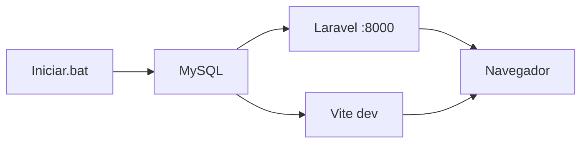

# Guía de instalación en Windows

Esta guía explica cómo instalar y levantar el **Sistema de Administración de Contenedores** en Windows, desde cero hasta tener el servidor Laravel y Vite funcionando.

---

## Resumen rápido (usuario básico)

Si ya tiene PHP, Composer, Node.js y MySQL instalados:

| Acción | Qué hacer |
|--------|-----------|
| **Primera vez** | Doble clic en `Instalar.bat` en la raíz del proyecto |
| **Siguientes veces** | Doble clic en `Iniciar.bat` |
| **Abrir la app** | Navegador en `http://127.0.0.1:8000` |

**Credenciales por defecto** (creadas por el seeder):

- Email: `admin@material.com`
- Contraseña: `secret`

---

## Requisitos previos

Instale estas herramientas **antes** de ejecutar los scripts. Todas deben estar disponibles en el **PATH** del sistema (abrir una nueva ventana de CMD y escribir el comando debe funcionar).

| Herramienta | Versión mínima | Descarga |
|-------------|----------------|----------|
| **PHP** | 8.2 | [windows.php.net](https://windows.php.net/download/) o incluido en Laragon/XAMPP |
| **Composer** | 2.x | [getcomposer.org](https://getcomposer.org/download/) |
| **Node.js** (incluye npm) | 18 LTS o superior | [nodejs.org](https://nodejs.org/) |
| **MySQL** | 8.0 | [MySQL Installer](https://dev.mysql.com/downloads/installer/), Laragon o XAMPP |

### Extensiones PHP requeridas

Habilite en su `php.ini`:

```
extension=curl
extension=fileinfo
extension=gd
extension=mbstring
extension=openssl
extension=pdo_mysql
extension=zip
extension=bcmath
```

Verifique con:

```cmd
php -v
php -m
composer -V
node -v
npm -v
mysql --version
```

---

## Opción A: Instalación automática (recomendada)

### 1. Clonar o descargar el proyecto

```cmd
git clone <url-del-repositorio> contenedores-pricer-cl
cd contenedores-pricer-cl
git checkout feature/leo-new-desing
```

### 2. Primera instalación

Ejecute **`Instalar.bat`** (doble clic o desde CMD):

```cmd
Instalar.bat
```

El script realiza automáticamente:

1. Verifica PHP, Composer, Node.js y npm
2. Crea `.env` desde `.env.windows.example`
3. `composer install`
4. `npm install`
5. `php artisan key:generate`
6. Inicia el servicio MySQL
7. Crea la base de datos `contenedores_pricer`
8. `php artisan migrate` y `php artisan db:seed`
9. `php artisan storage:link`
10. Abre Laravel (`php artisan serve`) y Vite (`npm run dev`) en ventanas separadas

### 3. Inicios posteriores

Ejecute **`Iniciar.bat`**:

```cmd
Iniciar.bat
```

Solo inicia MySQL, Laravel y Vite **sin reinstalar** dependencias.

---

## Opción B: Instalación manual paso a paso

Útil si prefiere control total o si los scripts automáticos fallan.

### Paso 1 — MySQL

#### Con MySQL Installer (servicio de Windows)

1. Instale MySQL Server 8.x
2. Anote usuario (`root`) y contraseña
3. Inicie el servicio:

```cmd
net start MySQL80
```

El nombre del servicio puede variar. Para listarlo:

```cmd
sc query type= service state= all | findstr /i mysql
```

#### Con XAMPP

1. Instale [XAMPP](https://www.apachefriends.org/)
2. Inicie MySQL desde el panel de control de XAMPP
3. En `scripts\windows\config.bat` configure:

```bat
set "MYSQL_SERVICE="
set "MYSQL_START_SCRIPT=C:\xampp\mysql_start.bat"
set "MYSQL_BIN=C:\xampp\mysql\bin\mysql.exe"
```

#### Con Laragon

1. Instale [Laragon](https://laragon.org/)
2. Inicie Laragon (MySQL arranca automáticamente)
3. PHP, Composer y Node suelen venir incluidos

### Paso 2 — Crear la base de datos

```cmd
mysql -u root -p -e "CREATE DATABASE IF NOT EXISTS contenedores_pricer CHARACTER SET utf8mb4 COLLATE utf8mb4_unicode_ci;"
```

Sin contraseña (típico en XAMPP/Laragon):

```cmd
mysql -u root -e "CREATE DATABASE IF NOT EXISTS contenedores_pricer CHARACTER SET utf8mb4 COLLATE utf8mb4_unicode_ci;"
```

### Paso 3 — Configurar el entorno

```cmd
copy .env.windows.example .env
```

Edite `.env` y ajuste la base de datos:

```env
DB_CONNECTION=mysql
DB_HOST=127.0.0.1
DB_PORT=3306
DB_DATABASE=contenedores_pricer
DB_USERNAME=root
DB_PASSWORD=

APP_URL=http://127.0.0.1:8000
```

### Paso 4 — Dependencias PHP y Node

```cmd
composer install
npm install
```

### Paso 5 — Clave de aplicación y base de datos

```cmd
php artisan key:generate
php artisan migrate
php artisan db:seed
php artisan storage:link
```

### Paso 6 — Levantar los servidores

Abra **dos terminales** en la raíz del proyecto:

**Terminal 1 — Laravel:**

```cmd
php artisan serve --host=127.0.0.1 --port=8000
```

**Terminal 2 — Vite (assets frontend):**

```cmd
npm run dev
```

### Paso 7 — Verificar

Abra en el navegador: **http://127.0.0.1:8000**

---

## Configuración de los scripts automáticos

Edite `scripts\windows\config.bat` si su entorno difiere del predeterminado:

```bat
REM Servicio de Windows (MySQL80, MySQL, MariaDB, etc.)
set "MYSQL_SERVICE=MySQL80"

REM Credenciales (deben coincidir con .env)
set "DB_HOST=127.0.0.1"
set "DB_PORT=3306"
set "DB_NAME=contenedores_pricer"
set "DB_USER=root"
set "DB_PASS="

REM Puerto de Laravel
set "LARAVEL_PORT=8000"

REM Rutas opcionales para XAMPP u otras instalaciones
set "MYSQL_BIN="
set "MYSQL_START_SCRIPT="
```

---

## Estructura de archivos Windows

```
contenedores-pricer-cl/
├── Instalar.bat              ← Primera instalación (doble clic)
├── Iniciar.bat               ← Inicio rápido (doble clic)
├── .env.windows.example      ← Plantilla de entorno para Windows
├── scripts/windows/
│   ├── config.bat            ← Configuración MySQL y puertos
│   ├── instalar.bat          ← Lógica de instalación
│   ├── iniciar.bat           ← Lógica de inicio
│   └── _helpers.bat          ← Funciones compartidas
└── docs/
    └── INSTALACION_WINDOWS.md
```

---

## Comandos útiles de mantenimiento

```cmd
REM Limpiar caché
php artisan cache:clear
php artisan config:clear
php artisan view:clear

REM Reejecutar migraciones (¡borra datos!)
php artisan migrate:fresh --seed

REM Compilar assets para producción
npm run build

REM Ver estado del proyecto
php artisan about
```

---

## Solución de problemas

### "PHP no se reconoce como comando"

- Reinstale PHP o agregue su carpeta al PATH del sistema
- Con Laragon/XAMPP, use la terminal integrada que ya tiene el PATH configurado

### "No se pudo iniciar MySQL"

1. Verifique que MySQL esté instalado
2. Pruebe manualmente: `net start MySQL80`
3. Si usa XAMPP, configure `MYSQL_START_SCRIPT` en `config.bat`
4. Confirme que el puerto 3306 no esté ocupado

### Error de conexión a base de datos

1. Revise que `DB_*` en `.env` coincida con `scripts\windows\config.bat`
2. Confirme que la base `contenedores_pricer` exista
3. Pruebe: `mysql -u root -p -e "SHOW DATABASES;"`

### "vendor\ no existe" al usar Iniciar.bat

Ejecute primero `Instalar.bat` o manualmente `composer install`.

### "node_modules\ no existe"

Ejecute `npm install` o vuelva a correr `Instalar.bat`.

### Vite no carga estilos / pantalla sin CSS

Asegúrese de que la ventana **"Vite Dev"** esté abierta y muestre `npm run dev` en ejecución. Sin Vite, Laravel no sirve los assets compilados en desarrollo.

### Puerto 8000 ocupado

Cambie `LARAVEL_PORT` en `config.bat` y `APP_URL` en `.env`, por ejemplo puerto `8080`:

```cmd
php artisan serve --host=127.0.0.1 --port=8080
```

---

## Flujo de trabajo diario



1. Ejecutar `Iniciar.bat`
2. Esperar que abran las ventanas "Laravel Server" y "Vite Dev"
3. Abrir `http://127.0.0.1:8000`
4. Al terminar, cerrar las dos ventanas de servidor

---

## Notas de seguridad

- Los valores de `.env.windows.example` son para **desarrollo local**
- No use la contraseña `secret` ni `APP_DEBUG=true` en producción
- No suba su archivo `.env` al repositorio

---

## Soporte

Para problemas técnicos, revise también el `README.md` principal del proyecto y los logs en:

```
storage\logs\laravel.log
```
